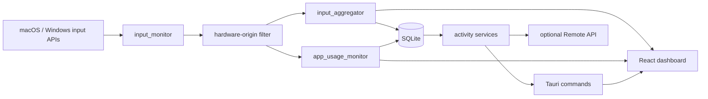

# MyTime

MyTime is a local-first desktop activity tracker built with Tauri, Rust, React, and SQLite. It records physical keyboard and mouse activity, tracks foreground application usage, and turns that local data into timelines, summaries, and productivity reports.

Setup (install, develop, release): [`docs/setup.md`](docs/setup.md).

## Features

### Hardware-only input activity

- Global keyboard, mouse-button, movement, and scroll capture on macOS and Windows.
- Synthetic input is rejected at the native hook boundary before it reaches counters, sessions, SQLite, or the UI.
- Windows uses the low-level injected-event flags exposed by the operating system (Layer 1a).
- macOS accepts only strict HID-system events without a positive source process ID.
- Remote OS sessions and virtual/RDP-style HID enumerators are ignored (Layer 1b). Product names are not used.
- Input content is not stored; MyTime records event types and high-level labels rather than typed text.

SendInput-class automation, on-screen keyboards, macros, and software remapping do not count. Active remote sessions (RDP, a macOS off-console remote login, virtual-HID-only) do not count. Filter-driver remotes that ride a physical USB/I2C device, USB HID gadgets, RDP Wrapper concurrent sessions, Screen Sharing the active Mac console, and kernel drivers can still look like local hardware.

### Activity analytics

- Dashboard metrics for active time, mouse events, and keystrokes.
- Live input pulse, recent activity feed, and keyboard/mouse visualization.
- Foreground application sessions with window title, process, duration, and input counts.
- Full-day status, active-window, and input-intensity timeline tracks.
- Daily activity timeline, weekly heatmap, focus correlation, and application-usage reports.
- A 30-second inactivity grace period, reflected in per-minute activity buckets.
- Per-minute work-quality scores (entropy rate of action types plus permutation entropy) so monotonous single-channel input does not look like peak intensity.
- Dashboard and Activity **Detection board** for live Layer 1 (hardware vs remote) and Layer 2 (work quality) status.

Why these layers exist, what they do, and what they do not cover: [`docs/input-integrity.md`](docs/input-integrity.md).

### Desktop lifecycle

- A single SQLite database in the application data directory.
- WAL mode, atomic aggregate upserts, bounded retention, and periodic checkpoints.
- Closing the main window hides it to the tray while activity collection continues.
- Single-instance handling focuses the existing window when MyTime is launched again.
- Optional start-at-login registration on Windows.

### Activity-only Remote API

MyTime can expose read-only activity JSON to a trusted central dashboard on the LAN. The server is configured from Help → Remote API and uses port `18765` by default.

- API guide: [`docs/api/README.md`](docs/api/README.md)
- Endpoint catalog: [`docs/api/endpoints.md`](docs/api/endpoints.md)
- Data models: [`docs/api/data-models.md`](docs/api/data-models.md)
- OpenAPI specification: [`docs/api/openapi.yaml`](docs/api/openapi.yaml)

The API has no authentication and should only be enabled on a trusted LAN or VPN with appropriate firewall rules.

## Architecture



### Input event flow

1. The native global hook receives an operating-system input event.
2. Origin classification rejects events identified as synthetic.
3. Accepted events update the input aggregator and current application session.
4. A bounded channel updates the in-memory live feed and emits compact batches to the frontend.
5. Only changed per-minute aggregates and application sessions are persisted.

Rejected input never updates movement throttling, sequence state, counters, sessions, visual key/button state, live feeds, or persistence.

## Data storage

The database file is `mytime.sqlite3` under Tauri's application data directory for `com.gladiator.mytime`. Logs are stored in a `logs` directory beside it.

| Table | Purpose |
|---|---|
| `schema_version` | Database migration version |
| `config` | Local application settings |
| `app_icons` | One icon per application |
| `activity_sessions` | Foreground application sessions and counts |
| `input_minutes` | Per-minute input aggregates and quality scores |

Raw keyboard and mouse events are intentionally ephemeral. This prevents event rate from controlling database size. Detailed sessions are retained for 366 days and compact minute aggregates for two years. Version 4 upgrades remove old raw-event rows, normalize duplicated session icons, and compact reclaimable database space.

Diagnostic log files are rotated daily, read through a bounded tail, and pruned every six hours after startup; files older than 30 days are removed.

Fresh installations do not create traffic-monitoring tables. Databases upgraded from versions that previously recorded traffic may retain an unused legacy `network_samples` table; MyTime does not read, write, prune, or expose those rows.

## Project structure

```text
mytime/
├── src/
│   ├── app/
│   │   ├── App.tsx                 # Application shell and views
│   │   ├── api/                    # Tauri invoke wrappers
│   │   ├── hooks/                  # Live and historical data hooks
│   │   ├── components/             # Dashboard, timeline, reports, Help
│   │   ├── activityAppUsage.ts     # DTO-to-visualization mapping
│   │   └── types/backend.ts        # Frontend DTO definitions
│   └── styles/
├── src-tauri/
│   ├── src/
│   │   ├── lib.rs                  # Tauri setup, tray, collectors, commands
│   │   ├── input_monitor/          # Native hooks and origin filtering
│   │   ├── input_aggregator.rs     # Counters and bounded recent feed
│   │   ├── app_usage_monitor.rs    # Foreground sessions and minute buckets
│   │   ├── db.rs                   # SQLite schema and queries
│   │   ├── services.rs             # Activity queries and summaries
│   │   ├── ipc.rs                  # Tauri commands
│   │   └── api_server/             # Optional activity-only HTTP API
│   └── Cargo.toml
├── docs/api/
├── package.json
└── README.md
```

## Development

Install, local commands, and GitHub Release secrets: [`docs/setup.md`](docs/setup.md).

## Privacy and security boundaries

- All activity is stored locally unless the user enables the Remote API.
- The Remote API is read-only but can expose application names, window titles, and activity counts.
- MyTime targets ordinary user-space automation; it is not a tamper-resistant monitoring system.
- SendInput-class injection and OS-remote / virtual-HID sessions are ignored. Filter-driver remotes that ride a physical HID device, USB gadgets, RDP Wrapper concurrent sessions, kernel drivers, modified binaries, stopped collectors, and direct database changes remain outside the protection boundary.
