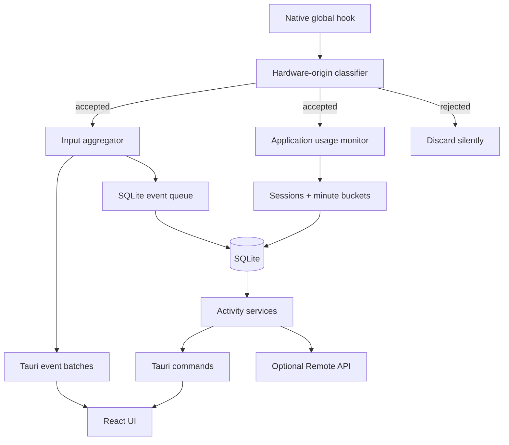

# MyTime Activity-Only Architecture Plan

## Product objective

MyTime is a local-first desktop activity tracker for macOS and Windows. It records physical keyboard and mouse activity, attributes accepted input to foreground-application sessions, and presents local productivity analytics without recording typed content.

## Product boundaries

### Included

- Strict native global input hooks.
- Hardware-origin filtering before any downstream state changes.
- Keyboard, mouse-button, pointer-movement, and scroll counts.
- Foreground application and window-title sessions.
- Per-minute activity buckets and a 30-second inactivity grace period.
- Dashboard, live feed, input visualization, timelines, heatmaps, and reports.
- Local SQLite persistence and logs.
- Optional read-only activity API for a trusted LAN.
- Tray operation, single-instance behavior, and Windows start-at-login.

### Excluded

- Capturing typed text, screenshots, documents, or clipboard contents.
- Traffic inspection, connection enumeration, bandwidth accounting, latency probes, or speed tests.
- Cloud synchronization or mandatory external services.
- Kernel-driver, virtual-HID, binary-tampering, or database-tampering resistance.

## Runtime architecture

### Input boundary invariant

Origin classification runs before event construction, emission, sequence tracking, movement throttling, aggregation, session attribution, frontend delivery, or persistence. Rejected events are not blocked from reaching other applications; MyTime only ignores them.

### Windows origin policy

- Reject keyboard events carrying `LLKHF_INJECTED` or `LLKHF_LOWER_IL_INJECTED`.
- Reject mouse events carrying `LLMHF_INJECTED` or `LLMHF_LOWER_IL_INJECTED`.
- Apply the predicate to presses, releases, movement, and scrolling in the shared low-level callback used by both the helper collector and in-process fallback.
- Ignore input while the OS reports a remote session, RDP-style HID enumerators, or virtual-only HID. Do not match remote-product process names. A leftover mirror adapter plus ROOT HID does not block when a physical HID is present.

### macOS origin policy

- Prefer the HID event-tap location, with a session tap only as installation fallback.
- Handle disabled-tap notifications before normal classification.
- Accept normal events only when their source state is HID-system state and the source process ID is non-positive.
- Ignore input while the session is not on the console (`kCGSSessionOnConsoleKey`). Screen Sharing the active console is not detected.
- Fail closed for missing, private, combined-session, positive-process, or unknown source metadata.

## Application usage

- Poll the foreground application/window independently of raw input storage.
- Attribute accepted input counts to the current application session.
- End or transition sessions when the foreground application/window changes.
- Persist completed sessions and checkpoint the active session.
- Mark the event minute and the minute containing `event + 30 seconds` active when the grace period crosses a minute boundary.

## Persistence

SQLite uses a single long-lived connection, WAL mode, `synchronous=FULL`, a busy timeout, incremental aggregate upserts, and bounded WAL checkpoints. Raw hook events are never persisted. App icons are normalized and written once per application rather than copied into every session.

### Active schema

- `schema_version`
- `config`
- `app_icons`
- `activity_sessions`
- `input_minutes`

Schema version 5 adds nullable per-minute `diversity_centi`, `timing_centi`, and `quality_centi`. Version 4 removed legacy raw input rows, moved session icons into `app_icons`, and compacted reclaimable space. Detailed sessions have bounded retention and minute aggregates remain the long-term activity source. An upgraded database may retain a dormant legacy `network_samples` table. The application must not read, write, prune, migrate, display, or expose that table.

## Interfaces

### Tauri commands

- Dashboard summary and input statistics.
- Recent accepted input events.
- Input-monitor status, permission, and diagnostics.
- Activity overview, application usage, session paging, minute buckets, heatmap, and timeline.
- Report/category configuration.
- Logs and Remote API settings.

### Remote API

The optional `/api/v1` server exposes health, metadata, Dashboard, input, and activity endpoints only. It remains read-only, unauthenticated, and intended for trusted LAN/VPN use.

The metadata contract includes application/runtime information and the API address. It does not expose connectivity status or probe results. Unknown and removed paths return `404 Not Found`.

## Frontend structure

### Dashboard

- Activity-only live pulse strip.
- Three summary cards: active time, mouse events, and keystrokes.
- Focus correlator.
- Activity timeline and input visualizer.

### Activity

- Four activity summary cards.
- Timeline tracks for status, active windows, and input intensity.
- Application usage breakdown and session list.
- Live accepted-input feed.
- Daily timeline and weekly heatmap.

### Logs and Help

- Logs display local backend diagnostics.
- Help documents the hardware-only policy, activity views, UI controls, and activity-only Remote API.

## Quality gates

Every release must pass:

1. Frontend production build.
2. Rust unit and integration tests.
3. Native macOS check/build.
4. Windows-target check, including helper and fallback hook code.
5. Fresh-schema and legacy-schema migration tests.
6. Physical input acceptance on built-in, USB, and Bluetooth devices.
7. Synthetic-input rejection tests using common automation tools.
8. Packaged-app permission validation on macOS.
9. Remote API smoke tests for activity routes and removed-path 404 behavior.

## Maintenance priorities

1. Preserve the hardware-origin boundary when refactoring native collectors.
2. Keep frontend DTOs synchronized with Rust serialization contracts.
3. Add database migrations without rewriting or destroying user activity history.
4. Keep mock/fallback UI data behaviorally aligned with production responses.
5. Measure source, bundle, and packaged application size after material feature changes.
